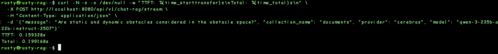
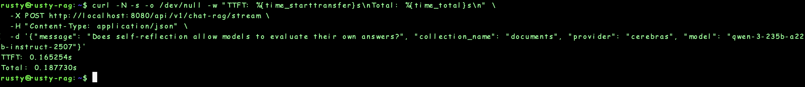
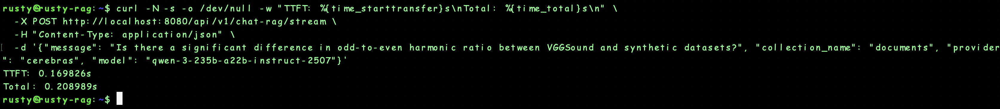
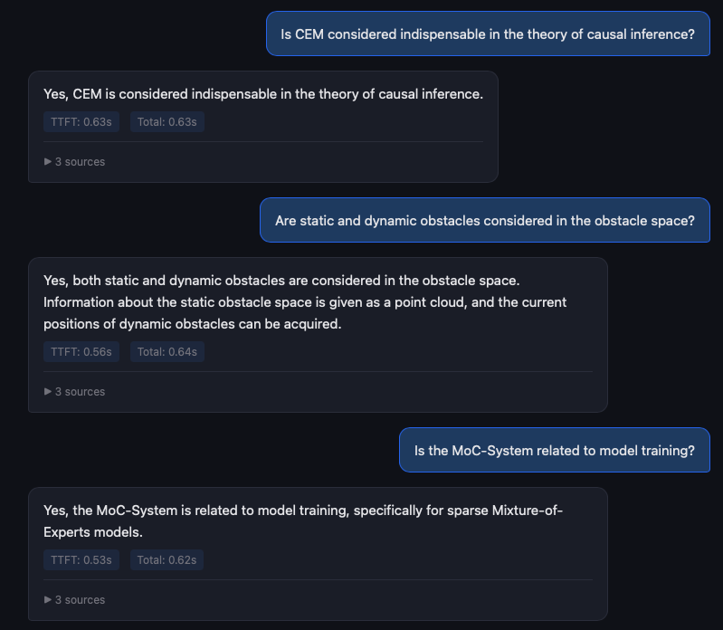
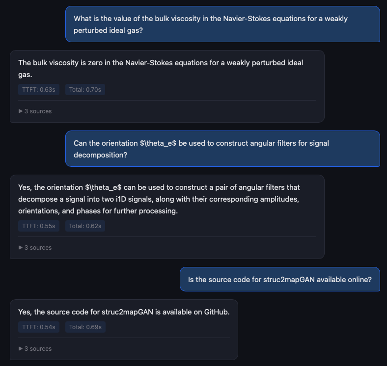
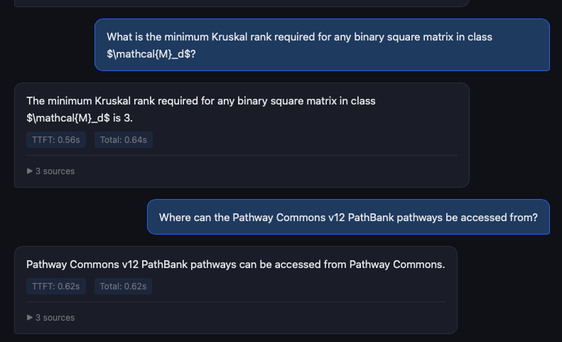
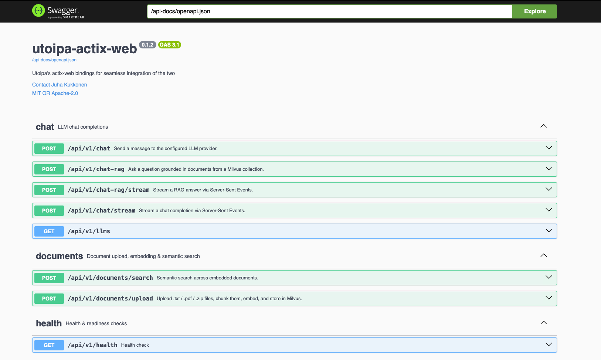

<div align="center">

# RustyRAG

### The lowest-latency open-source RAG app

Sub-200ms responses on localhost. Sub-600ms to a browser across continents. No GPU required.

<br/>

<a href="https://cerebras.ai"></a>
<a href="https://groq.com"></a>
<a href="https://jina.ai"></a>
<a href="https://milvus.io"></a>
<a href="https://huggingface.co"></a>

<br/><br/>


<br/><br/>

Built by **Ignas Vaitukaitis** &nbsp; <a href="https://www.linkedin.com/in/ignas-vaitukaitis/"></a> <a href="https://x.com/zer0tokens"></a>

</div>

---

## Benchmarks

| Metric | Value |
|--------|-------|
| Localhost response time | **< 200ms** |
| Remote response time (Azure North Central US → Rio de Janeiro) | **< 600ms** |
| Instance | Azure F4s_v2 (no GPU) |
| Sources per response | 3 |
| PDFs ingested | 977 |
| Chunks in Milvus | 56,114 |

### Localhost (curl → localhost:8080)

RAG streaming responses with 3 sources, Cerebras `qwen-3-235b-a22b-instruct-2507`. TTFT = time to first token.

<p>

</p>
<p>

</p>
<p>

</p>

### Browser (Azure North Central US → Rio de Janeiro)

Same 977-PDF corpus, same model. Chat UI showing TTFT and total response time per query.

<p>

</p>
<p>

</p>
<p>

</p>

---

## What's New in v0.2

⚡ **Cerebras & Groq as LLM providers** — pick any model and go

⚡ **Jina AI local embeddings** — replaced Cohere with `jina-embeddings-v5-text-nano-retrieval` for the best speed-to-quality ratio

⚡ **Contextual retrieval** — LLM-generated context prefixes per chunk for better accuracy (opt-in)

Also:
- Built on **Rust + Actix-Web**
- **Milvus** vector DB with **Swagger UI**
- **Docker Compose** — pull, add `.env`, build, run
- Supports **PDFs** and **zipped PDF bundles**

---

## Why RustyRAG?

Most RAG stacks glue together Python microservices with high per-request overhead. RustyRAG collapses the entire pipeline -- document ingestion, semantic chunking, contextual retrieval, vector search, and LLM streaming -- into a **single async Rust binary**.

### Key Features

- **Full RAG pipeline in one binary** -- upload, chunk, embed, store, search, and generate
- **Contextual retrieval** -- LLM-generated context prefixes per chunk (inspired by [Anthropic's Contextual Retrieval](https://www.anthropic.com/news/contextual-retrieval)) enrich embeddings for significantly better search accuracy
- **Semantic chunking** -- sentence-boundary-aware splitting via `text-splitter`, with configurable overlap
- **Per-page PDF extraction** -- page numbers preserved through the pipeline for source attribution
- **Dual LLM providers** -- [Groq](https://groq.com) and [Cerebras](https://www.cerebras.ai/), chosen for their low-latency inference hardware (Groq LPU, Cerebras wafer-scale engine)
- **Local embeddings** -- `jina-embeddings-v5-text-nano-retrieval` served via HuggingFace TEI, selected for its top MTEB ranking among small models (768-dim, best performance-to-cost ratio)
- **Real-time SSE streaming** -- tokens stream to the client as they're generated, with sources delivered as a leading SSE event
- **Milvus HNSW vector search** -- cosine similarity with tunable `ef` and `M` parameters
- **Concurrent document ingestion** -- ZIP archives processed across parallel workers with batched embedding calls
- **Interactive Swagger UI** -- every endpoint documented with OpenAPI 3.0
- **Built-in chat frontend** -- a minimal SSE-powered UI at `/static/chat.html` for testing RAG and plain chat

---

## Architecture

```
                                RustyRAG
┌──────────┐         ┌─────────────────────────────────────────────────┐
│          │   SSE   │                                                 │
│  Client  │◄───────►│  Actix-web Router                              │
│          │         │       │                                        │
└──────────┘         │       ├── /documents/upload                    │
                     │       │     │                                  │
                     │       │     ├─ Extract text (PDF pages / TXT)  │
                     │       │     ├─ Semantic chunking               │
                     │       │     ├─ Contextual prefix generation ──►│── LLM API
                     │       │     ├─ Embed (prefix + chunk) ────────►│── Jina TEI
                     │       │     └─ Insert vectors ────────────────►│── Milvus
                     │       │                                        │
                     │       ├── /chat-rag/stream                     │
                     │       │     ├─ Embed query ───────────────────►│── Jina TEI
                     │       │     ├─ Vector search ─────────────────►│── Milvus
                     │       │     └─ Stream answer ─────────────────►│── LLM API
                     │       │                                        │
                     │       └── /chat/stream                         │
                     │             └─ Direct LLM streaming ──────────►│── LLM API
                     └─────────────────────────────────────────────────┘
```

---

## Quick Start

### Prerequisites

- **Rust 1.70+** -- install via [rustup](https://rustup.rs/)
- **Docker & Docker Compose** -- for local embeddings and Milvus
- **Groq API key** -- get one at [console.groq.com](https://console.groq.com/)
- **Cerebras API key** -- get one at [cloud.cerebras.ai](https://cloud.cerebras.ai/)

### 1. Clone and configure

```bash
git clone https://github.com/AlphaCorp-AI/RustyRAG
cd rustyrag
cp .env.example .env
```

Edit `.env` with your API keys:

```env
GROQ_API_KEY=gsk_your-groq-key-here
CEREBRAS_API_KEY=csk_your-cerebras-key-here
```

### 2. Start infrastructure

```bash
docker compose up -d
```

This starts **Jina embeddings** (via HuggingFace TEI) and **Milvus 2.4** locally.

### 3. Build and run

```bash
cargo build --release
cargo run --release
```

The server starts at `http://127.0.0.1:8080`.

### 4. Try it out

- **Chat UI** -- [http://localhost:8080/static/chat.html](http://localhost:8080/static/chat.html)
- **Swagger UI** -- [http://localhost:8080/swagger-ui/](http://localhost:8080/swagger-ui/)

Upload a PDF, ask a question, and watch tokens stream back with source citations.

---

## LLM Providers

RustyRAG uses **Groq** and **Cerebras** as LLM providers because they offer the lowest inference latency available today -- Groq via custom LPU hardware and Cerebras via wafer-scale engine. Both expose OpenAI-compatible APIs, and you can switch between them per request.

### Groq
- `llama-3.1-8b-instant`
- `llama-3.3-70b-versatile`
- `openai/gpt-oss-120b`
- `openai/gpt-oss-20b`

### Cerebras
- `llama3.1-8b`
- `gpt-oss-120b`
- `qwen-3-235b-a22b-instruct-2507`
- `zai-glm-4.7`

Override provider and model per request using `"provider"` and `"model"` fields in any `/chat` or `/chat-rag` endpoint.

---

## Embeddings

RustyRAG uses **jina-embeddings-v5-text-nano-retrieval** for vectorization. This model was selected for its exceptional performance-to-cost ratio: it ranks among the top small embedding models on the [MTEB benchmark](https://huggingface.co/spaces/mteb/leaderboard) while producing compact 768-dimensional vectors and running efficiently on CPU via HuggingFace Text Embeddings Inference (TEI).

The model supports asymmetric retrieval (separate document/query task types), which RustyRAG uses automatically -- documents are embedded with the `retrieval.passage` task and queries with `retrieval.query`. See the [jina-embeddings-v5-text paper](https://arxiv.org/abs/2602.15547) for details on the architecture.

---

## RAG Pipeline

### Upload flow

```
File upload (.txt, .pdf, or .zip -- streamed to disk, never held in memory)
  -> Text extraction with page numbers (PDF via pdf-extract / TXT via UTF-8)
  -> ZIP? Unpack and process entries concurrently
  -> Semantic chunking (sentence-boundary-aware, configurable size + overlap)
  -> Contextual prefix generation per chunk via LLM (sliding page window)
  -> Embed (prefix + chunk text) via local Jina TEI
  -> Batch insert into Milvus (vectors encode contextual meaning)
```

### Contextual retrieval

Each chunk is enriched with an LLM-generated context prefix before embedding. The LLM receives a document overview (first ~2K characters) plus a sliding window of pages around the chunk (2 pages before and after), and produces a 1-2 sentence description of the chunk's role in the document.

This prefix is **concatenated with the chunk text before embedding**, so the resulting vector captures both the chunk content and its broader document context. At query time, the standard cosine similarity search naturally finds better matches because the stored vectors encode richer semantic meaning.

The raw chunk text is stored separately in Milvus, keeping the LLM context clean.

### Query flow

```
User question
  -> Embed query via Jina TEI
  -> Milvus HNSW search (top-K, cosine similarity against enriched vectors)
  -> Inject retrieved chunks as system prompt context
  -> Stream LLM answer via SSE (Groq or Cerebras)
  -> Sources emitted as leading "event: sources" SSE event
```

---

## API Reference

All endpoints live under `/api/v1`. Interactive documentation via Swagger UI at [`/swagger-ui/`](http://localhost:8080/swagger-ui/).

<p>

</p>

### Documents

| Method | Endpoint | Description |
|--------|----------|-------------|
| `POST` | `/documents/upload` | Upload `.txt`, `.pdf`, or `.zip` -- chunks, embeds with contextual prefixes, stores in Milvus |
| `POST` | `/documents/search` | Semantic search across embedded documents |

### Chat

| Method | Endpoint | Description |
|--------|----------|-------------|
| `GET`  | `/llms` | List supported models with provider names |
| `POST` | `/chat` | Single-turn LLM completion |
| `POST` | `/chat/stream` | SSE-streamed LLM completion |
| `POST` | `/chat-rag` | RAG: retrieve context, generate answer |
| `POST` | `/chat-rag/stream` | SSE-streamed RAG (sources event + LLM tokens) |

### Health

| Method | Endpoint | Description |
|--------|----------|-------------|
| `GET`  | `/health` | Liveness check |

> Full request/response schemas are available in the Swagger UI above.

---

## Configuration

| Variable | Description | Default |
|----------|-------------|---------|
| `GROQ_API_KEY` | Groq API key | -- |
| `CEREBRAS_API_KEY` | Cerebras API key | -- |
| `MILVUS_URL` | Milvus REST API endpoint | `http://localhost:19530` |
| `EMBEDDING_API_URL` | Embedding endpoint (OpenAI-compatible) | `http://localhost:7997/v1/embeddings` |
| `EMBEDDING_MODEL` | Embedding model name | `jinaai/jina-embeddings-v5-text-nano-retrieval` |
| `EMBEDDING_DIMENSION` | Vector dimensionality | `768` |
| `EMBEDDING_MAX_BATCH_SIZE` | Chunks per embedding API call | `8` |
| `CHUNK_SIZE` | Max characters per chunk (semantic splitting) | `2000` |
| `CHUNK_OVERLAP` | Overlap characters between chunks | `200` |
| `CONTEXTUAL_RETRIEVAL_PROVIDER` | LLM provider for context prefix generation | `cerebras` |
| `CONTEXTUAL_RETRIEVAL_MODEL` | LLM model for context prefix generation | `gpt-oss-120b` |
| `CONTEXTUAL_RETRIEVAL_CONCURRENCY` | Parallel LLM calls for context generation | `4` |
| `CONTEXTUAL_RETRIEVAL_MAX_DOC_CHARS` | Max document chars per contextual prompt | `12000` |
| `MILVUS_METRIC_TYPE` | Vector similarity metric | `COSINE` |
| `MILVUS_INDEX_TYPE` | Milvus index type | `HNSW` |
| `MILVUS_HNSW_M` | HNSW M parameter | `16` |
| `MILVUS_HNSW_EF_CONSTRUCTION` | HNSW ef_construction | `256` |
| `MILVUS_SEARCH_EF` | HNSW search ef (latency/recall trade-off) | `64` |
| `HOST` | Server bind address | `127.0.0.1` |
| `PORT` | Server port | `8080` |

---

## Project Structure

```
src/
├── main.rs                 # Entry point, server bootstrap
├── config.rs               # Env-based config via serde + envy
├── routes.rs               # Route registration
├── errors.rs               # Unified AppError -> HTTP response mapping
├── handlers/
│   ├── chat.rs             # /llms, /chat, /chat/stream, /chat-rag, /chat-rag/stream
│   ├── documents.rs        # /documents/upload, /documents/search, contextual retrieval
│   └── health.rs           # /health
├── schemas/
│   ├── requests.rs         # Validated request DTOs (serde + validator)
│   └── responses.rs        # Response DTOs with utoipa OpenAPI schemas
├── services/
│   ├── llm.rs              # Groq + Cerebras OpenAI-compatible client
│   ├── embeddings.rs       # Local/OpenAI-compatible embedding client
│   ├── milvus.rs           # Milvus v2 REST client (collections, insert, search)
│   └── document.rs         # PDF/TXT extraction, semantic chunking
├── prompts/
│   ├── mod.rs              # Prompt builder functions
│   ├── rag_system_prompt.txt       # RAG system prompt template
│   └── contextual_prompt.txt      # Contextual retrieval prompt template
static/
└── chat.html               # Built-in SSE chat + RAG frontend
docker-compose.yml          # Jina TEI embeddings + Milvus 2.4
```

---

## Tech Stack

| Layer | Technology | Role |
|-------|-----------|------|
| **Runtime** | Rust + Tokio + Actix-web 4 | Async web server |
| **LLM** | Groq (LPU) + Cerebras (wafer-scale) | Low-latency chat completions + SSE streaming |
| **Embeddings** | Jina v5 text nano retrieval (TEI) | Local vectorization, 768-dim, MTEB-leading small model |
| **Contextual Retrieval** | LLM-generated chunk prefixes | Enriched embeddings for better search accuracy |
| **Vector DB** | Milvus 2.4 (HNSW, cosine) | Sub-millisecond approximate nearest neighbor search |
| **Chunking** | text-splitter crate | Semantic sentence-boundary-aware splitting |
| **Docs** | utoipa + Swagger UI | Auto-generated interactive API documentation |
| **Ingestion** | pdf-extract + zip crate | PDF text extraction with page numbers, ZIP processing |
| **Infra** | Docker Compose | One-command local embeddings + Milvus setup |

---

## Development

```bash
# Development mode
cargo run

# Debug logging
RUST_LOG=debug cargo run

# Production build
cargo build --release
./target/release/rustyrag
```

---

## License

MIT

---

<div align="center">
  <br/>
  Built by <strong>Ignas Vaitukaitis</strong> &nbsp; <a href="https://www.linkedin.com/in/ignas-vaitukaitis/"></a> <a href="https://x.com/zer0tokens"></a>
  <br/><br/>
</div>
